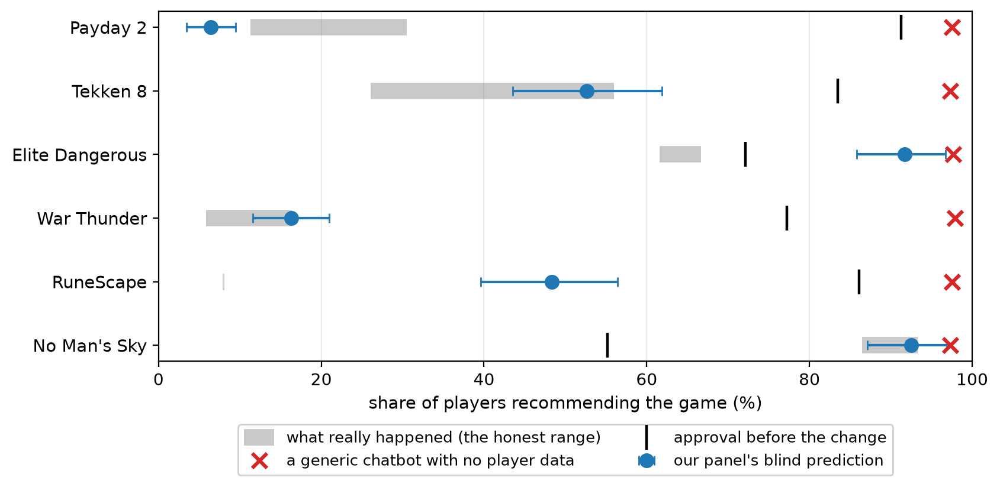
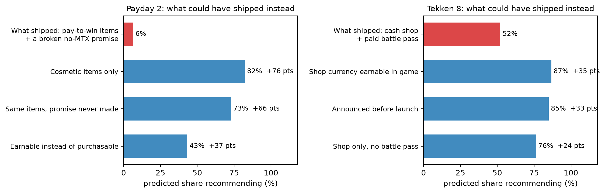

# Steam-LLMSonas

LLM persona panels built from real Steam reviewers, used to predict how a game's
players react to a monetization change before it happens.

For each case we take the people who reviewed a game *before* a dated event (a
paid game adding microtransactions, a battle pass, an economy change, a
paid-to-free switch, and so on), turn each of them into a short third-person
persona from their behavioural history alone, and ask a model whether that player
would still recommend the game after the change. The prediction is scored blind
against the real recommend rate that shows up in reviews *after* the event, read
straight from a historical review dump. Nothing about the outcome touches persona
construction, so every score is a held-out prediction, not a fit.

## Result, honestly

Six real events, every prediction made blind and only then compared to the
recorded outcome:

| Case | What shipped | Real approval after | Panel, blind | Call |
|---|---|---|---|---|
| Payday 2 | Pay-to-win microtransactions after a public no-MTX promise | fell to 11–31%* | 6% | Right collapse, slightly harsher than reality |
| **Tekken 8** | Cash shop + paid battle pass in a full-price fighter | fell to 26–56%* | **53%** | **Essentially exact — and the event post-dates the model's training cutoff, so it could not have been memorised** |
| Elite Dangerous | Cosmetics-only store, partly earnable | mild dip, 62–67%* | 92% | Correctly called "no blow-up", too optimistic on the level |
| War Thunder | Free-to-play economy tightening | fell to 6–16%* | 16% | Essentially exact |
| RuneScape | Battle pass on top of an existing subscription | collapsed to 8% | 48% | Right direction, under-called the severity |
| No Man's Sky (control) | Free improvement update, no monetization | rose to 87–93%* | 93% | Predicts goodwill as well as backlash — not just an anger detector |

\* Steam allows one review per account, so "players who edited existing reviews"
and "players posting for the first time after the change" are two real, distinct
populations; the range is the honest span between them, not measurement error.



The grounding is the signal: ask an ungrounded chatbot with no data on the
actual players and it answers roughly "97% would recommend" on every case,
regardless of what really happened.

The method predicts calm when the real reaction is calm and a collapse when it
collapses, rather than always leaning negative. It is not perfect: the failure
modes are measured and reported, not hidden. The main one is a level problem: the
model orders personas correctly, but the overall level follows the model's own
reading of the change, sometimes too harsh and sometimes too forgiving, which we
probe with a set of labelled control runs. Every verdict is confirmed across
three independent panel seeds with bootstrap confidence intervals.

## From scoring to decision support

Because the shipped decision is validated, the same panel can re-answer the
question for hypothetical variants of it — a counterfactual "menu" of the
decision (`scripts/counterfactual_menu.py`). On Payday 2, making the new items
cosmetic-only recovers +76 points of approval versus what shipped; not breaking
the public promise recovers +66; making items earnable recovers +37. On Tekken 8,
announcing the shop before launch buys back nearly as much goodwill as removing
real-money purchases entirely (+33 vs +35). Only the shipped row is checked
against reality; the menu is read as a ranking of options, not absolute levels.



One boundary, tested directly: panels predict what players publicly *say*, not
what they *do* — on Payday 2, 85% of the players who trashed the game in reviews
were still playing it a month later, and per-persona behaviour prediction sits at
chance (AUC ≈ 0.5). That limit is reported, not hidden.

## Reports

- [`docs/technical-report.pdf`](docs/technical-report.pdf) — the full method:
  persona construction, permutation-averaged option-token logprob readout (cancels
  option-position bias), third-person reformulation (mitigates social-desirability
  bias), labelled controls, seed robustness, and per-case error analysis.
- [`docs/stakeholder-brief.pdf`](docs/stakeholder-brief.pdf) — the same results
  written for a studio decision-maker, no jargon.

A scored case costs roughly $0.50 of compute and runs in minutes; the live
data-ingestion path works on any current Steam title's review base.

## Layout

```
llmsonas/
  config.py        pinned run settings (model, seed, the smoke-test case)
  cases.py         the scored cases and the run harness that drives them
  data/            load a game's reviews from the dump; live-pull for the smoke test
  features/        per-user behavioural feature vectors
  construction/    persona selection, segmentation, exposure, third-person bios
  survey/          survey prompt + option-token logprob readout
  graph/           the M3 homophily graph and Friedkin-Johnsen opinion dynamics
  scoring/         aggregation, bootstrap CIs, divergence
scripts/           one entry point per case, plus the control/ablation probes
docs/              technical report, stakeholder brief, figures
tests/
```

## Running it

```bash
python -m venv .venv
.venv\Scripts\activate          # source .venv/bin/activate on macOS/Linux
pip install -e .                # installs llmsonas plus everything in requirements.txt

copy .env.example .env          # then put your Together key in .env
```

The persona calls go to Together (`TOGETHER_API_KEY` in `.env`). You do not need a
key to check the wiring: set `LLMSONAS_OFFLINE=1` and a deterministic stub stands
in for the model, so the whole ladder runs end to end without a network call.

```bash
python -m pytest                              # 22 tests
set LLMSONAS_OFFLINE=1                         # Windows; use export on *nix
python scripts/smoke_test_payday2.py          # the Payday 2 flagship case, offline
```

The historical review dump is large and is not included here. The code expects
the "Steam Reviews 2024" per-app dump as a zip under `Historical Data/` (see
`llmsonas/data/dump.py` for the exact path and member layout). The offline flag
only swaps in a stub for the model, so the dump-backed cases still need that zip
to read their ground truth; without it they raise a clear file-not-found.

Scored runs print a methods-by-question table to stdout and drop their
transcripts and per-persona CSVs in `out/` (git-ignored).

## About

Built solo as an independent research study.
Author: Priyam Rai — MSc AI (Imperial College London) · [github.com/PriamR](https://github.com/PriamR)
